# Supa-pliance

A Next.js application for monitoring Supabase project compliance, focusing on security best practices and configuration standards.

## ✨ Live Demo ✨

🌐 **Check it out:** [https://supa-pliance.vercel.app/](https://supa-pliance.vercel.app/) 🚀

## 🎯 Features

### Core Functionality
- **Compliance Checks**
  - Multi-Factor Authentication (MFA) status verification
  - Row Level Security (RLS) enforcement monitoring
  - Point in Time Recovery (PITR) configuration validation
- **Real-Time Monitoring**
  - Live status updates via Supabase real-time subscriptions
  - Instant notification of compliance changes
- **Evidence Collection**
  - Timestamped logs for each check
  - Historical compliance records
  - Detailed change tracking

### Advanced Features
- **Auto-Fix Capabilities**
  - Automated issue resolution
  - Guided fix suggestions
  - Security-conscious remediation
- **AI-Powered Assistant**
  - Context-aware troubleshooting
  - Best practice recommendations
  - Interactive problem resolution

## 📸 Screenshots

### Landing Page
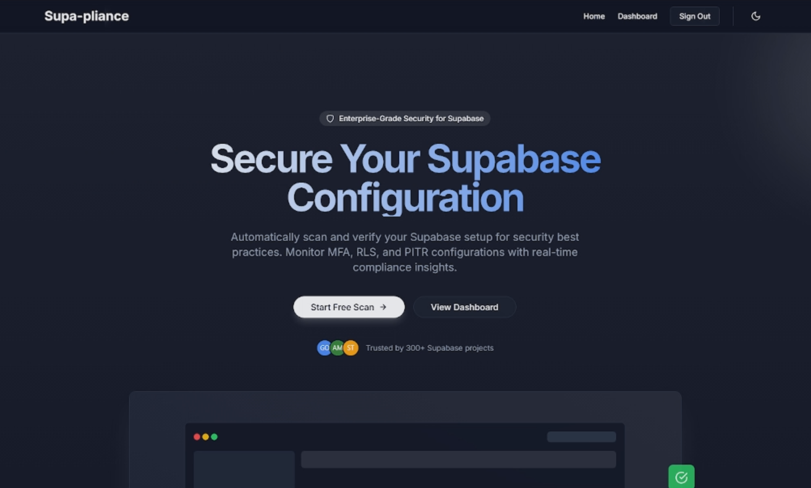

### Landing Page with Feature Highlights
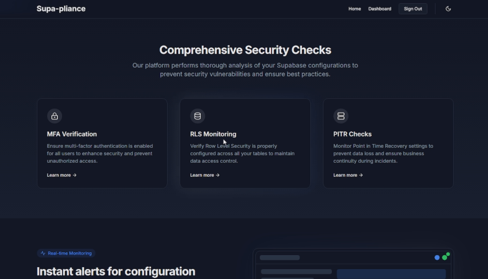

### Projects List Page
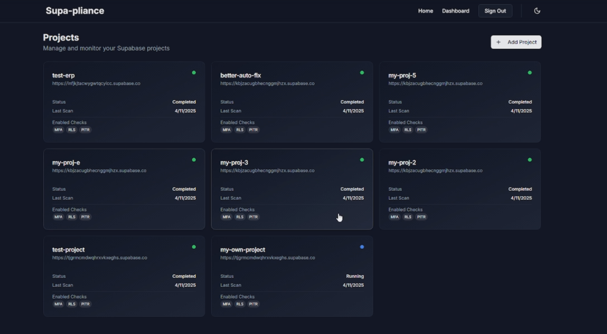

### Create Project Page
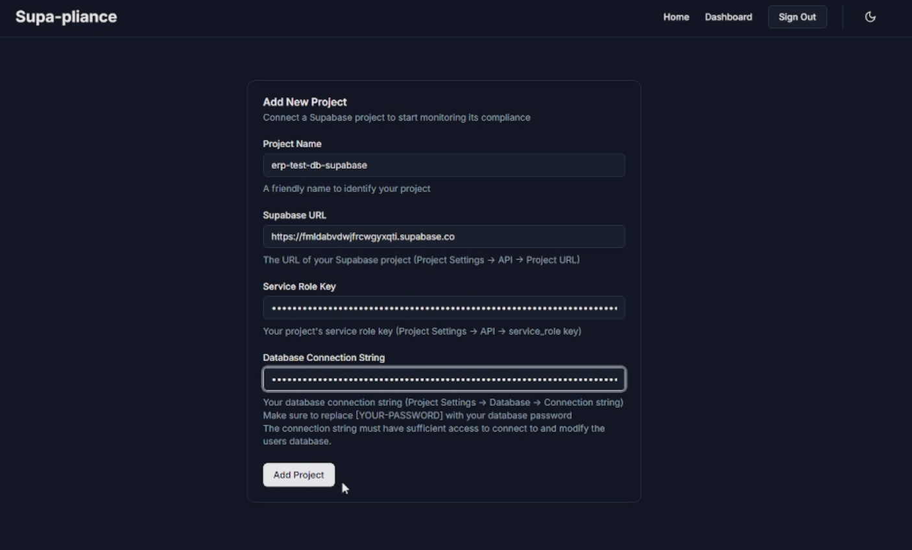

---

## Compliance Scan Views

### Project's Database Scan Details Page
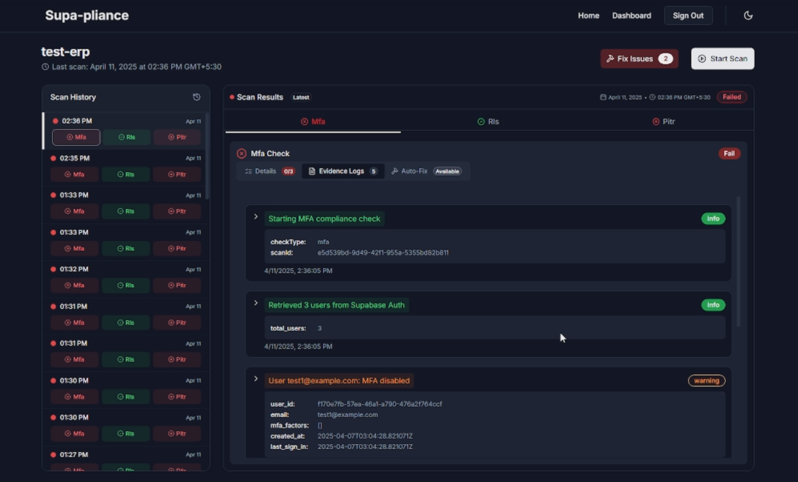

### Project's Database Scan Ongoing View
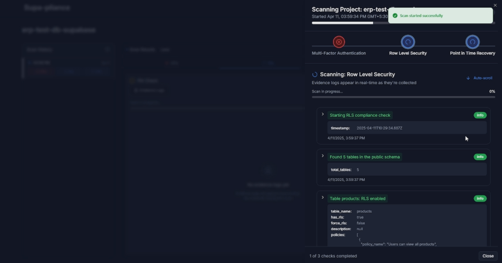

---

## Detailed Tabs & Auto-Fix

### MFA Details Tab
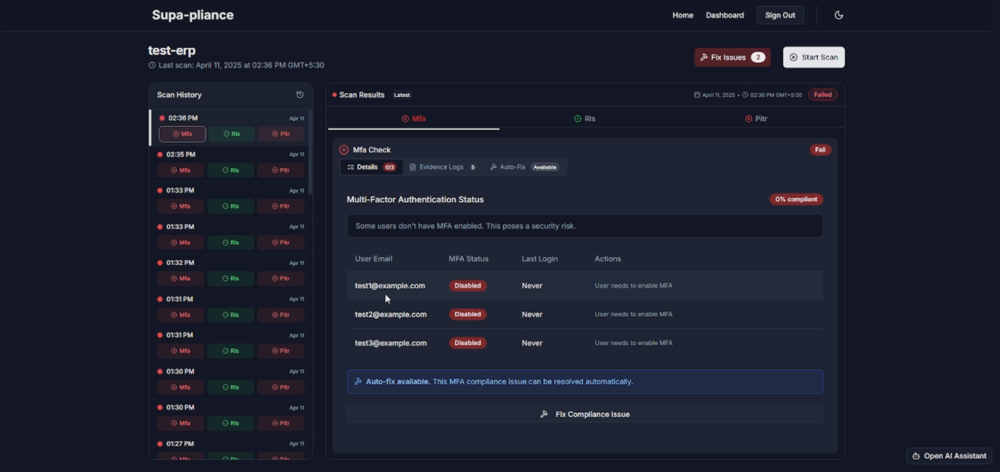

### MFA Auto-Fix Tab
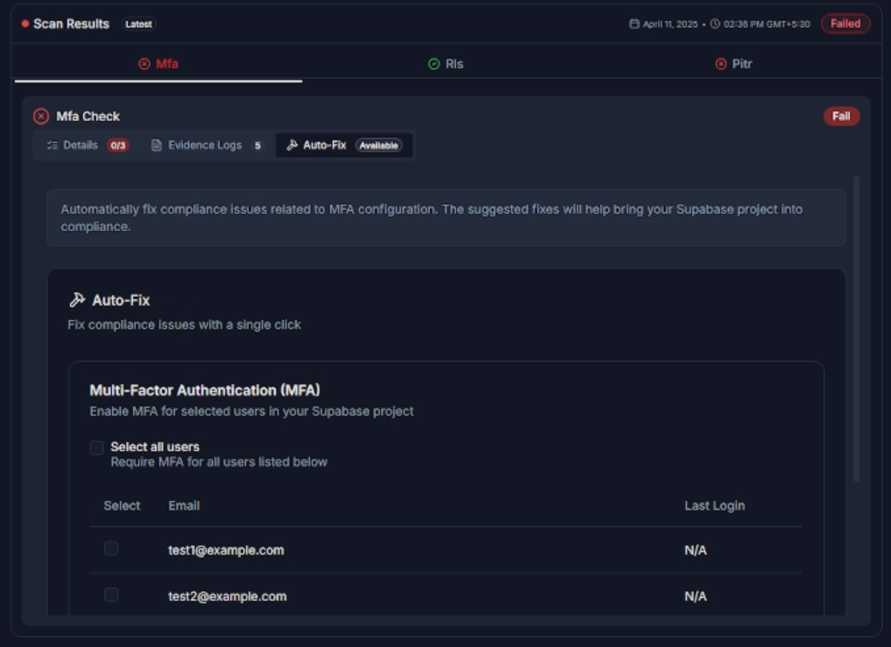

### MFA Evidence Logs Tab
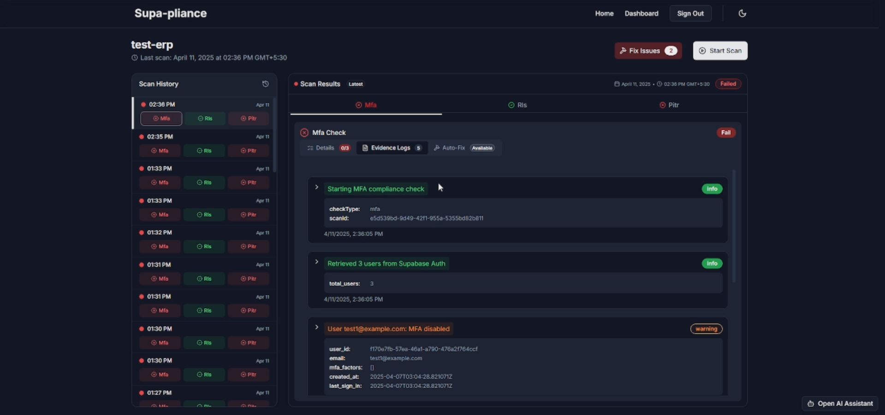

---

### RLS Details Tab
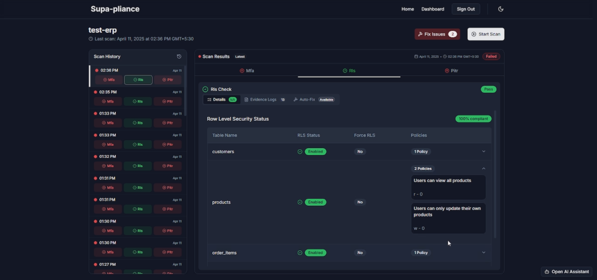

### RLS Auto-Fix Tab
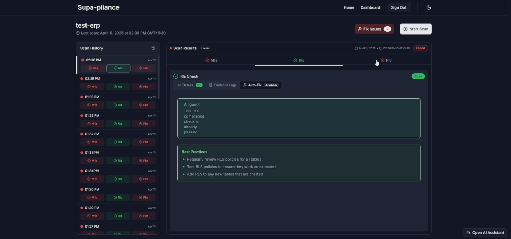

---

### PITR Details Tab
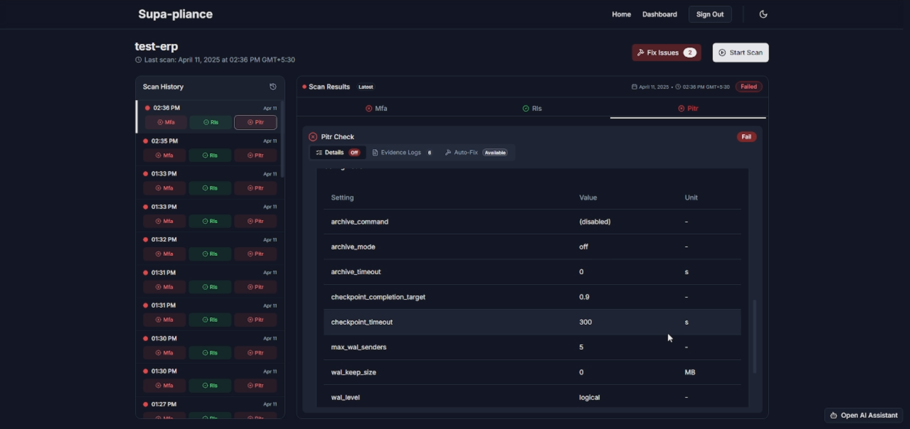

### PITR Auto-Fix Tab
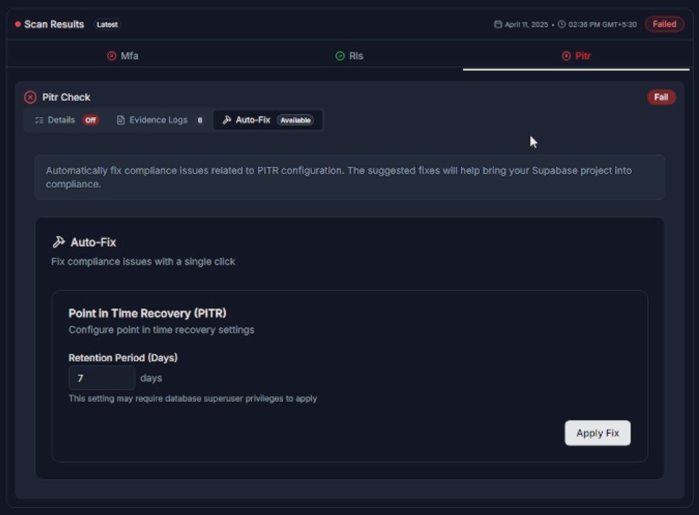

### PITR Evidence Logs Tab
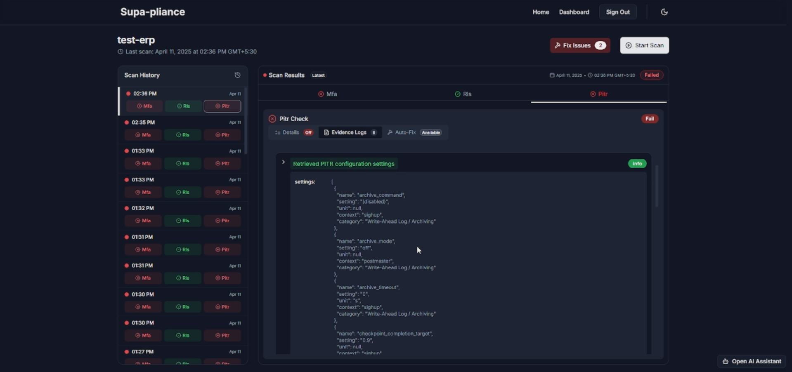

---


## 🚀 Getting Started

### Prerequisites
- Node.js >= 18.0.0
- npm or yarn
- Supabase account and project

### Installation

1. Clone the repository

2. Install dependencies:
```bash
cd frontend
npm install
```

3. Copy and set up environment variables:
```bash
cp .env.example .env.local
```

4. Run the development server:
```bash
npm run dev
```

## 🏗️ Project Structure

```
supa-pliance/
├── frontend/                # Next.js application
│   ├── src/                # Source code
│   │   ├── app/           # App router pages and layouts
│   │   ├── components/    # Reusable React components
│   │   └── lib/          # Utility functions and hooks
│   ├── public/            # Static assets
│   ├── .env.example       # Example environment variables
│   ├── .env.local         # Local environment variables
│   ├── package.json       # Frontend dependencies
│   ├── tailwind.config.js # Tailwind CSS configuration
│   ├── postcss.config.js  # PostCSS configuration
│   ├── next.config.mjs    # Next.js configuration
│   ├── tsconfig.json      # TypeScript configuration
│   └── components.json    # Shadcn UI components configuration
└── supabase/              # Database configuration
    ├── migrations/        # Database migrations
    └── config.toml        # Supabase configuration
```

## 🤝 Contributing

1. Fork the repository
2. Create your feature branch (`git checkout -b feature/amazing-feature`)
3. Commit your changes (`git commit -m 'Add some amazing feature'`)
4. Push to the branch (`git push origin feature/amazing-feature`)
5. Open a Pull Request

## 🙏 Acknowledgments

- [Supabase](https://supabase.io/) for the amazing backend platform
- [Next.js](https://nextjs.org/) for the frontend framework
- [Shadcn UI](https://ui.shadcn.com/) for the beautiful UI components
- [Tailwind CSS](https://tailwindcss.com/) for the styling system

---

Built with ❤️ for the Supabase community 